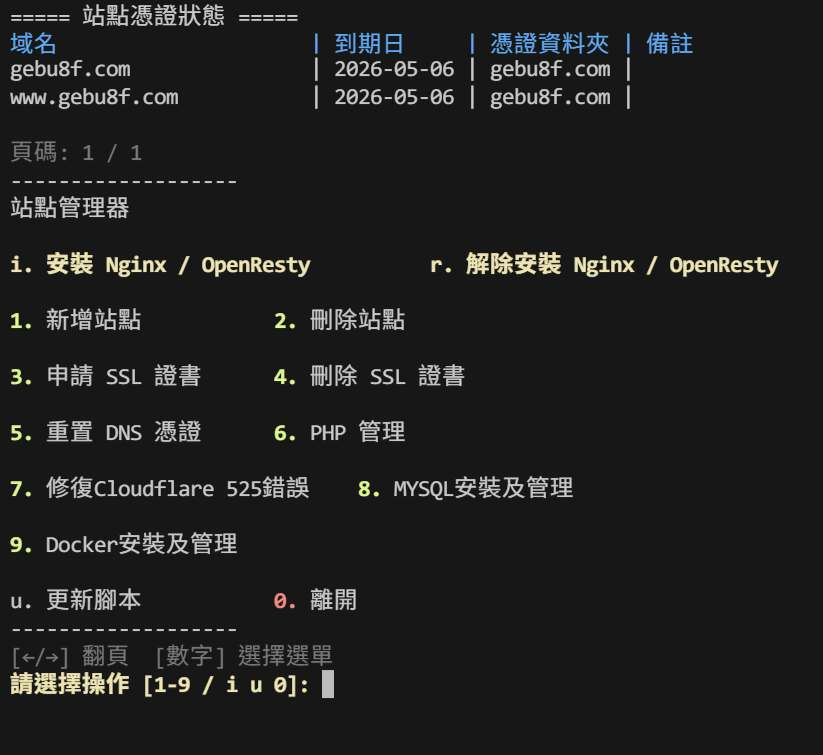

# Nginx/Caddy 全自動建站工具

# 注意 !
- 本腳本採取選擇性設計原則：  
- 僅加入經過測試、穩定、必要的功能。  
- 對於可能影響系統相容性或造成混亂的需求，將不予加入，並在必要時說明理由。  
- 穩定性優先於功能多樣性，是本腳本的核心理念。

# 🔐 授權 License

本專案以 [Apache License 2.0](./LICENSE) 授權，您可以自由使用、修改、商用或學術用途，條件如下：

- **請保留原始作者署名（標註我）**
- **若有修改，請明確標註變更**
- **禁止移除授權資訊後冒充原作者**
- **不提供任何保固或技術責任**

# 介紹
這是一套Nginx/Caddy + SSL + WordPress 自動化建站腳本，專為 VPS 多系統環境設計，支援 **Debian / RHEL / Alpine** 三大主流系統，讓你一鍵完成完整建站流程。

# 📌 備註
我目前已將專案主力倉庫搬遷至 GitHub，原本長期維護於 GitLab（提交數已累積超過 900 次以上），目前此 GitHub 倉庫屬於新建立版本，因此提交紀錄較少屬正常情況。
🔗 原始 GitLab 倉庫：https://gitlab.com/gebu8f/sh

---

## 特點亮點

### 主力是本地,除非不支援
以前是以為openresty官方會更新很勤快，但現在發現：已經都有RHEL 10 、 Debian 13 了，官方本地版還沒支援！相信有些人已經等不及,我就動手寫一下代碼讓他用docker，但我用docker network 用host 保證不會經過NAT打斷效率

### 跨三大主流系統自動適配
自動偵測系統，根據環境自動採用：
- apt（Debian/Ubuntu）
- yum / dnf（CentOS/RHEL） 【RHEL 7和 8 完全不支援】
- apk（Alpine）

### 支援多家 CA 與 DNS / HTTP 驗證
我是使用[acme.sh](https://github.com/acmesh-official/acme.sh)，原因就是追求極致輕量化和拒絕黑箱作業。但我有將預設CA ZeroSSL切換成Letsencrypt。
- 憑證機構選擇：
  - Let's Encrypt
  - ZeroSSL
  - Google Trust Services
- 驗證方式（API Token 驗證）：
  - Cloudflare DNS
  - DNSPod.cn DNS
  - Aliyun DNS
- 傳統認證
  - HTTP(webroot)

*本腳本不支持ip的HTTP認證

### WordPress 一鍵部署
- 自動建立資料庫與帳號密碼
- Nginx和Caddy 配置自動完成

### 全面錯誤處理與修復
- 權限自動設定(完全配合SELinux)
- 修復cloudflare 525錯誤(SSL加密問題)

### PHP
- 可以手動指定版本
- 可升級/降級版本
- 指定安裝php擴展
- 設定php上傳和記憶體大小(記憶體固定1536MB 如果需要手動修改自行找php.ini)

### 備份和還原
- 動動手指就能輕易備份(如果有資料庫的話需要dba指令), **不支援自動備份,防止成功的失敗**
- 在部屬flarum和Wordpress 會詢問是否還原備份

### 防禦
- 本腳本使用HttpGuard 開源防禦程序 能防禦CC攻擊 【有管理面板】

## 主選單
- 你可以看到你的域名和到期時間和證書資料夾
- 還可以翻頁(十個域名1頁)
- 優化效能,加入快取

畫面:



---


## 安裝與使用
```
bash <(curl -sL https://sh.gebu8f.com/site)
```
*後續可用site命令開啟*
